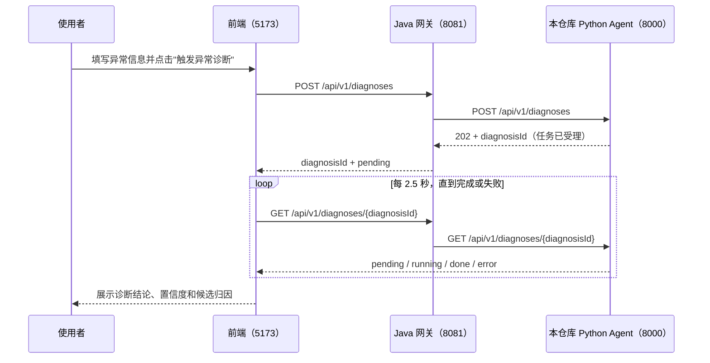

# 信贷数据异常排查 Agent

助贷业务场景：FPD30 逾期率异常 → Agent 自主排查归因。
接入范围：看板数据接口（只读）+ 历史案例库 + 业务背景 KB，无代码执行层。

## 整体系统：三个仓库拼成一次完整 demo

本仓库只是"诊断大脑"。完整的手动触发 demo 由三个独立仓库组成，运行时是同级目录关系：

| 仓库 | 角色 | 默认端口 |
|---|---|---|
| `credit-anomaly-agent`（本仓库） | 诊断 Agent：收到异常事件，跑归因排查，返回结论 | 8000 |
| [`anomaly-trigger-service`](https://github.com/paulyu00/anomaly-trigger-service) | Java 网关：接前端请求，转发给本服务，代理查询结果 | 8081 |
| [`anomaly-diagnosis-console`](https://github.com/paulyu00/anomaly-diagnosis-console) | React 前端：手动触发页面，填表单、看结论 | 5173 |



Java 是纯转发层，不做任何分析，也不在后台主动轮询 Python；本仓库不知道、也不关心异常是谁触发的，只负责"给一段异常描述，吐出一个归因结论"。字段怎么从 Java 请求体映射到 `Orchestrator.run()` 的参数，见 [`BACKEND_INTEGRATION.md`](./BACKEND_INTEGRATION.md)。

### 三个服务一起跑

假设三个仓库是同级目录（如 `Agent building/credit-anomaly-agent`、`Agent building/anomaly-trigger-service`、`Agent building/anomaly-diagnosis-console`）：

```bash
# 1. 本仓库：诊断 Agent
cd credit-anomaly-agent
pip install -r requirements.txt
python data/generate_mock_data.py
MOCK_LLM=1 uvicorn api:app --port 8000 &

# 2. Java 网关（需要 JDK 17+）
cd ../anomaly-trigger-service
DIAGNOSIS_SERVICE_BASE_URL=http://localhost:8000 ./mvnw spring-boot:run &

# 3. 前端
cd ../anomaly-diagnosis-console
npm install
npm run dev
```

打开 `http://localhost:5173`，填表单、点"触发异常诊断"即可看到三层完整跑通。

> 踩坑记录：如果系统默认 JDK 版本较新（实测 JDK 25），编译 `anomaly-trigger-service` 时 Lombok 可能报一堆 `cannot find symbol`（getter/setter 找不到）。换成 JDK 17～21（`export JAVA_HOME=...` 指到对应版本）即可解决，跟代码本身无关。

## 快速开始

```bash
pip install -r requirements.txt
python data/generate_mock_data.py   # 生成带埋点异常的模拟数据
streamlit run app.py                # 打开界面，点"开始排查"
```

默认 `MOCK_LLM=1`（无需 API key 即可跑通全流程）。接 Kimi：

```bash
export MOONSHOT_API_KEY=sk-xxx
export MOCK_LLM=0
```

命令行直接跑主循环（调试用）：`PYTHONPATH=. python agent/orchestrator.py`

### 只起本仓库的 HTTP 服务（不需要 Java/前端时）

```bash
uvicorn api:app --host 0.0.0.0 --port 8000
```

两个接口：`POST /api/v1/diagnoses`（提交异常事件，返回 `diagnosisId`）、
`GET /api/v1/diagnoses/{diagnosisId}`（轮询排查状态/结论），可以直接用
`curl` 或 `http://localhost:8000/docs` 单独测试，不依赖 Java/前端。三个
服务如何配合见上面"整体系统"一节。

## 埋点故事线（demo 的"标准答案"）

2026-07-20 起 channel_C（新接入贷超渠道）放量：占比 8%→29%，该渠道用户
信用分偏低且携带评分未覆盖的薄档案风险 → FPD30 从 14.2% 抬升到 16.7%。
审批线全程未动（用于证伪"审批口径变化"假设）。
**真相 = 渠道质量下滑**，agent 应通过 渠道占比拆解 → 分渠道逾期率对比 →
历史案例印证 这条链路挖出来。

## 架构：概念 → 代码落点对标表

| 设计概念 | 出处/原型 | 落点 |
|---|---|---|
| Orchestrator + Investigator 双角色 | 主 loop + 4 个子 agent 返回 ItemSearchOutput 的模式 | `agent/orchestrator.py` / `agent/investigator.py` |
| 树形推理 · best-first 搜索 | 每轮展开当前分数最高的假设分支 | `Orchestrator._pick_hypothesis()` |
| Context 折叠（cache breakpoint 思路） | 最近 K 次工具调用保留 raw，更早的压成 digest | `Orchestrator._fold_context()`，K 在 `config.CONTEXT_WINDOW_K` |
| 按需展开（ItemSearchOutput 不平铺 attributes） | 工具返回 summary + records 两层，规则引擎读 records，trace 折叠后只留 digest | `tools/dashboard.py` 返回结构 |
| 巧思1: RAG 历史案例先验 | 排查前先检索案例库，命中的 root_cause_tag 获先验分 | `Orchestrator._seed_prior()` |
| 巧思2: 打分卡式置信度评分 | WOE/IV 思路：证据 × 权重累加；LLM 判断按 confidence 连续缩放 | `agent/hypotheses.py` 规则表 + `agent/scoring.py` |
| 巧思3: Reflect 自我核验 | 收敛后给次优假设一次补查机会，用对立证据检验结论 | `Orchestrator._reflect()` |
| 巧思4: 查询预算 | MAX_TOOL_CALLS=8，收敛阈值 0.30 | `config.py` |
| 巧思5: 敏感数据脱敏 | user_id 为合成 ID；金额只用分桶值 | `data/generate_mock_data.py` |
| numeric / llm_judgment 混合判断 | 数值规则纯代码算；综合判断走 LLM 结构化输出 | `agent/scoring.py` `NUMERIC_CHECKS` + `agent/llm_client.py` |
| 巧思6: 案例入库 rubric | 诊断结束后打分卡式评估证据多样性/收敛边际/reflect 稳健性/新颖性，≥0.7 自动入库，0.45~0.7 转人工复核 | `agent/curation.py`，人工复核用 `scripts/review_candidates.py` |
| 巧思7: 外部监管/政策信号 | 新增 web_search 工具 + regulatory_policy_change 假设，第一个访问外部网络的工具 | `tools/web_search.py`，假设定义在 `agent/hypotheses.py` |

## 目录结构

```
credit-anomaly-agent/
├── config.py                  # 预算/收敛/折叠窗口/LLM 配置，全部集中在这
├── data/
│   └── generate_mock_data.py  # 模拟数据（含埋点异常），schema 即数据契约
├── tools/                     # 三个只读工具（真实环境只换这层的实现）
│   ├── dashboard.py           #   query_dashboard: 看板指标查询
│   ├── retrieval.py           #   历史案例检索 + 业务 KB 检索（本地 BGE embedding，语义匹配）
│   └── web_search.py          #   web_search: 外部监管/政策新闻检索（第一个访问网络的工具）
├── kb/
│   ├── historical_cases.json  # 案例库种子（4 条，覆盖 4 类归因）+ rubric 自动入库的新案例
│   ├── case_candidates.json   # rubric 打了 candidate 档、等人工复核的案例（运行时生成）
│   └── business_kb.md         # 业务口径/术语（审批线、FPD30、渠道说明…，`## term` + 正文的简单 Markdown）
├── agent/
│   ├── hypotheses.py          # 假设池 + 探测树节点 + 证据规则表
│   ├── scoring.py             # 评分引擎（check_condition 混合判断）
│   ├── investigator.py        # 子角色：执行单个 probe，返回紧凑结果
│   ├── orchestrator.py        # 主循环：先验→best-first→收敛→reflect
│   ├── curation.py            # 案例入库 rubric：门槛 + 加权分 -> high_quality/candidate/reject
│   └── llm_client.py          # Kimi 封装 + MOCK 模式
├── scripts/
│   └── review_candidates.py   # candidate 档人工复核 CLI
├── app.py                     # Streamlit：异常现象→推理过程→归因结论 三屏
├── api.py                     # FastAPI：对接 Java 的 HTTP 接口层（POST/GET diagnoses）
└── BACKEND_INTEGRATION.md     # 给 Java 后端同学看的接口契约文档
```

## 排查主流程（一次运行的时间线）

```
Step 0  先验检索        retrieve_historical_case("FPD30环比上升")
                        → 命中 case_2025_11 → channel_quality_decline +0.05 先验
Round 1 展开最高分假设   p_ch_share:   channel_C 占比 +21pp   → r1 触发 +0.30
                        p_ch_overdue: channel_C 高出其他渠道 73% → r2 触发 +0.30
        收敛检查        0.65 vs 0.03，领先 > 0.30 → 收敛
Reflect 自我核验        补查次优假设"审批口径变化"的 p_ap_score
                        → 信用分未见 >10 分下移 → 无新证据，结论保持
Final   渠道质量下滑（置信度 0.65），预算使用 4/8
```

## 接真实环境时要改什么

1. `tools/dashboard.py`：把 pandas 读 CSV 换成公司看板 API 调用，**返回 dict 的
   schema 不变**，上层零改动——这就是当初"先定数据契约再等接口"的意义
2. `kb/*.json`：换成真实历史案例和口径文档；`tools/retrieval.py` 已经是
   本地 BGE embedding 检索，量大后要换更大的模型或接向量数据库，函数签名不变
3. `agent/hypotheses.py`：假设池和规则表按真实业务扩展；权重先专家拍定，
   积累标注案例后可用逻辑回归反推（对应打分卡的训练思路）
4. `config.py`：`MOCK_LLM=0` 接 Kimi

## 已知简化（评审可能会问，提前想好答案）

- 权重是拍定的，不是学出来的 → 回答：与打分卡冷启动一致，先专家经验后数据驱动
- 假设池是预定义的封闭集合 → 回答：可加"其他/未知"兜底假设 + LLM 开放式生成新假设入池
- MOCK 模式的 LLM 判断是关键词规则 → 仅为无 key 演示兜底，真实判断走结构化输出
- 每轮固定展开 2 个 probe → 可升级为 LLM 动态决定展开顺序（树搜索的策略函数）
- 部分 KB 检索类证据规则（r6/r8）不随场景数据变化 → 检索的是静态知识库/历史案例，query 没有
  跟实际探测到的数值证据（如 r8 对应的 p_dq_count 实测结果）绑定；`agent/hypotheses.py` 里
  同类的 r3 已经改成 phenomenon 驱动检索修复，r6/r8 需要 probe 间传递数据这类更大改动，详见
  `scripts/eval_scenarios.py` 顶部说明
